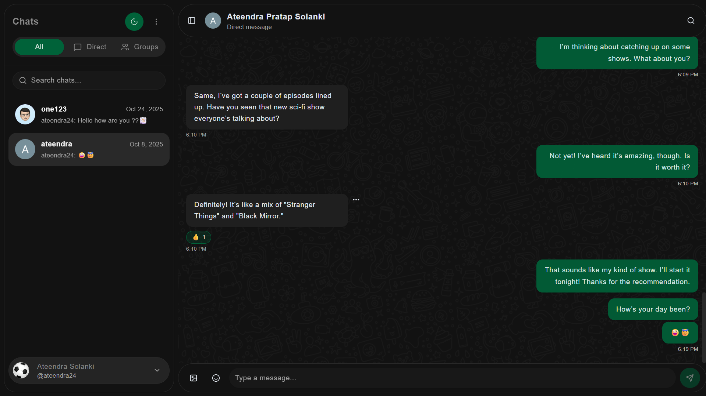

# Realtime Chat Application

A modern, full-featured realtime chat application built with Next.js 15, TypeScript, Pusher, Clerk Auth, and PostgreSQL. Features both direct messaging and group chat functionality with a polished user experience and production-ready scalability.

## Screenshot




## Architecture Diagram


## Features Implemented

- ✅ User Authentication (Clerk)
- ✅ User Registration with Profile Picture Upload
- ✅ Real-time Messaging (Pusher)
- ✅ Real-time Message Reactions (Pusher Events)
- ✅ Direct Messages
- ✅ Group Chats
- ✅ Group Management (Add/Remove Members)
- ✅ Group Avatar Upload
- ✅ Unread Message Counts
- ✅ User Presence (Online/Offline Status)
- ✅ Message Search
- ✅ Responsive Design (Mobile-First)
- ✅ Dark/Light Theme Toggle
- ✅ Production-Ready Deployment (Vercel)

## Tech Stack

- **Frontend**: Next.js 15.5.2 (App Router), React 19, TypeScript
- **UI Components**: shadcn/ui with Radix UI primitives
- **Styling**: Tailwind CSS with custom theme variables
- **Authentication**: Clerk (complete auth flow with SSO callback)
- **Real-time Communication**: Pusher (managed WebSocket service)
- **Database**: PostgreSQL with Drizzle ORM (schema with migrations)
- **State Management**: Custom React hooks with optimistic updates
- **Development**: Next.js with Turbopack for fast rebuilds
- **Deployment**: Vercel-ready serverless architecture
- **Type Safety**: Full TypeScript coverage with proper interfaces

## Setup Instructions

### 1. Environment Variables

Create a `.env.local` file with the following credentials:

```env
# Clerk Authentication (Required)
NEXT_PUBLIC_CLERK_PUBLISHABLE_KEY=your_clerk_publishable_key_here
CLERK_SECRET_KEY=your_clerk_secret_key_here

# Database (Required for full functionality)
DATABASE_URL=your_postgresql_connection_string_here

# Pusher Configuration (Required for real-time features)
PUSHER_APP_ID=your_pusher_app_id
PUSHER_KEY=your_pusher_key
PUSHER_SECRET=your_pusher_secret
PUSHER_CLUSTER=your_pusher_cluster

# Public Pusher Configuration (Client-side)
NEXT_PUBLIC_PUSHER_KEY=your_pusher_key
NEXT_PUBLIC_PUSHER_CLUSTER=your_pusher_cluster

# Optional: ImageKit for avatar uploads
NEXT_PUBLIC_IMAGEKIT_PUBLIC_KEY=your_imagekit_public_key
IMAGEKIT_PRIVATE_KEY=your_imagekit_private_key
NEXT_PUBLIC_IMAGEKIT_URL_ENDPOINT=your_imagekit_url_endpoint
```

### 2. Get Clerk Credentials

1. Visit [Clerk.com](https://clerk.com) and create an account
2. Create a new application
3. Copy the publishable key and secret key to your `.env.local` file
4. Configure sign-in/sign-up options in Clerk dashboard

### 3. Get Pusher Credentials

1. Visit [Pusher.com](https://pusher.com) and create an account
2. Create a new Channels app
3. Go to "App Keys" tab in your app dashboard
4. Copy the App ID, Key, Secret, and Cluster to your `.env.local` file
5. Use the same Key value for both `PUSHER_KEY` and `NEXT_PUBLIC_PUSHER_KEY`

### 4. Database Setup (Required)

1. Create a PostgreSQL database (recommended: [Neon](https://neon.tech) or [Supabase](https://supabase.com))
2. Add the connection string to your `.env.local` file
3. Run database migrations:

```bash
npm run db:generate
npm run db:push
```

### 5. Install Dependencies & Start Development

```bash
# Install all dependencies
npm install

# Start the development server
npm run dev
```

This will start the Next.js app on [http://localhost:3000](http://localhost:3000) with real-time features powered by Pusher.

### 6. Production Deployment

The application is ready for production deployment on Vercel:

```bash
# Build for production
npm run build

# Or deploy to Vercel
vercel --prod
```

Make sure to add all environment variables to your Vercel project settings.

## Scripts

- `npm run dev` - Start development server with Pusher real-time features
- `npm run build` - Build for production with Turbopack
- `npm run start` - Start production server
- `npm run lint` - Run ESLint for code quality
- `npm run db:generate` - Generate database migrations with Drizzle
- `npm run db:push` - Push database schema changes to PostgreSQL

## Project Structure

```
src/
├── app/                    # Next.js 15 App Router
│   ├── (auth)/            # Authentication routes
│   │   ├── sign-in/       # Clerk sign-in page
│   │   └── sign-up/       # Clerk sign-up page
│   ├── api/               # API routes
│   │   ├── chats/         # Chat management endpoints
│   │   │   ├── route.ts   # List user chats
│   │   │   ├── [chatId]/  # Individual chat operations
│   │   │   │   ├── messages/ # Message CRUD operations
│   │   │   │   └── unread/   # Unread message management
│   │   │   └── direct/    # Direct chat creation
│   │   ├── groups/        # Group management endpoints
│   │   ├── users/         # User operations (search, sync)
│   │   └── realtime/      # Real-time event triggers
│   ├── chat/              # Main chat interface
│   │   └── page.tsx       # Chat application UI
│   ├── home/              # Home page redirect
│   ├── sso-callback/      # Clerk SSO callback
│   ├── layout.tsx         # Root layout with providers
│   └── page.tsx           # Landing page
├── components/            # Reusable React components
│   ├── ui/                # shadcn/ui base components
│   ├── ChatList.tsx       # Chat sidebar with real-time updates
│   ├── Messages.tsx       # Message display with reactions
│   ├── MessageInput.tsx   # Message composition
│   ├── ChatHeader.tsx     # Chat info and actions
│   ├── CreateGroup.tsx    # Group creation dialog
│   ├── UserSearch.tsx     # User discovery and selection
│   ├── GroupInfoSheet.tsx # Group management interface
│   └── ...               # Additional UI components
├── hooks/                 # Custom React hooks
│   ├── useChatLogic.ts    # Core chat state management
│   ├── useRealtime.ts     # Pusher client connection
│   └── ...               # Additional utility hooks
├── db/                    # Database layer
│   ├── index.ts           # Database connection setup
│   ├── schema.ts          # Drizzle ORM schema definitions
│   └── schema-new.ts      # Updated schema with latest fields
├── lib/                   # Utility libraries
│   ├── utils.ts           # Common utility functions
│   ├── pusher.ts          # Pusher server configuration
│   └── imagekit.ts        # Image upload configuration
└── types/                 # TypeScript type definitions
    └── global.d.ts        # Global type declarations
```

## How It Works

### System Flow Diagram


### Architecture Overview

1. **Authentication**: Users sign in through Clerk's secure authentication system with full session management
2. **Real-time Connection**: Pusher provides managed WebSocket connections for instant communication
3. **Chat Management**: Users can create direct chats or group chats with full CRUD operations
4. **Message Flow**: Messages are stored in PostgreSQL and broadcasted via Pusher events for instant delivery
5. **State Synchronization**: Real-time updates for chat lists, unread counts, and participant changes

### Component Architecture


### Key Features in Detail

#### Real-time Messaging

- **Instant delivery** via Pusher managed WebSocket connections
- **Message persistence** in PostgreSQL with full message history
- **Duplicate prevention** using message IDs and client-side deduplication
- **Optimistic UI updates** with server confirmation and error handling

#### Chat Types

- **Direct Chats**: Private 1-on-1 conversations between users
- **Group Chats**: Multi-participant conversations with admin controls
- **Auto-joining**: Users automatically join all their chat rooms on connection

#### User Experience

- **Unread indicators** with real-time count updates (hidden for active chats)
- **Smart timestamps** with relative time formatting
- **Auto-scrolling** to latest messages with smooth animations
- **Responsive design** that works perfectly on desktop and mobile
- **Theme support** with light/dark mode toggle

#### Technical Implementation

- **Type-safe** end-to-end with TypeScript interfaces
- **Error handling** with user-friendly fallbacks and retry mechanisms
- **Performance optimized** with efficient database queries and minimal re-renders
- **Pusher channel management** for targeted message delivery

## Database Schema

The application uses a comprehensive PostgreSQL schema with the following key tables:

- **`users`** - User profiles with Clerk integration, avatars, and online status
- **`chats`** - Chat containers (direct or group) with metadata
- **`chatParticipants`** - Many-to-many relationship between users and chats
- **`messages`** - All messages with content, timestamps, and edit/delete status
- **`reactions`** - Message reactions with emoji and user tracking
- **`readReceipts`** - Track read status for unread count functionality

All tables include proper foreign key relationships, indexes for performance, and timestamps for auditing.

## Recent Updates & Improvements

### Performance & UX Enhancements

- ✅ **Eliminated visual flicker** when sending messages (unread counts, chat styling)
- ✅ **Duplicate message prevention** with robust client-side and server-side deduplication
- ✅ **Enhanced error handling** for undefined user data and network failures
- ✅ **Optimized Pusher events** with targeted channel-based message delivery
- ✅ **Improved message flow** - server handles all broadcasting to prevent race conditions

### Real-time Features

- ✅ **Smart chat list updates** - automatic refresh when new messages arrive
- ✅ **Global state synchronization** - all participants see updates instantly
- ✅ **Proper room management** - users automatically join/leave appropriate chat rooms
- ✅ **Unread count accuracy** - real-time updates with proper read receipt tracking

### Code Quality

- ✅ **Full TypeScript coverage** with proper interfaces and type safety
- ✅ **Modular architecture** with reusable hooks and components
- ✅ **Comprehensive error boundaries** and graceful degradation
- ✅ **Clean separation of concerns** between UI, business logic, and data layers

## Future Enhancements

### Potential Features (Not Currently Implemented)

- [ ] **Typing indicators** - Show when users are composing messages
- [ ] **File/image sharing** - Upload and share multimedia content
- [ ] **Message search** - Search through chat history across all conversations
- [ ] **Push notifications** - Browser notifications for new messages when app is minimized
- [ ] **Message threading** - Reply to specific messages with threaded conversations
- [ ] **Voice messages** - Record and send audio messages
- [ ] **Video calls** - Integrate WebRTC for video/audio calling
- [ ] **Message encryption** - End-to-end encryption for enhanced privacy
- [ ] **Admin controls** - Advanced group management features
- [ ] **User presence** - Online/offline status indicators (removed in current version)

### Technical Improvements

- [ ] **Message pagination** - Load older messages on demand for better performance
- [ ] **Offline support** - Queue messages when connection is lost
- [ ] **Message delivery status** - Sent/delivered/read indicators
- [ ] **Custom themes** - User-selectable color schemes and customization
- [ ] **Mobile app** - React Native version for iOS/Android

## Getting Started

### Prerequisites

- Node.js 18+ and npm
- PostgreSQL database (local or cloud)
- Clerk account for authentication

### Quick Start

1. Clone the repository
2. Install dependencies: `npm install`
3. Set up environment variables (see setup instructions above)
4. Run database migrations: `npm run db:push`
5. Start development server: `npm run dev`
6. Visit [http://localhost:3000](http://localhost:3000)

### Usage

1. **Sign up/Sign in** using the authentication pages
2. **Create a direct chat** by searching for users and starting a conversation
3. **Create a group** using the sidebar controls and invite multiple users
4. **Send messages** which appear instantly for all participants
5. **Manage groups** by adding/removing members or updating group info

## Contributing

1. Fork the repository
2. Create a feature branch (`git checkout -b feature/amazing-feature`)
3. Make your changes with proper TypeScript types
4. Test thoroughly with both direct and group chats
5. Commit your changes (`git commit -m 'Add amazing feature'`)
6. Push to the branch (`git push origin feature/amazing-feature`)
7. Open a Pull Request

### Development Guidelines

- Maintain TypeScript type safety throughout
- Test real-time features with multiple browser windows
- Ensure responsive design works on all screen sizes
- Follow the existing code patterns and component structure

## License

MIT License - see [LICENSE](./LICENSE) file for details

---

Built with ❤️ using Next.js 15, Pusher, and modern web technologies.

```

```
